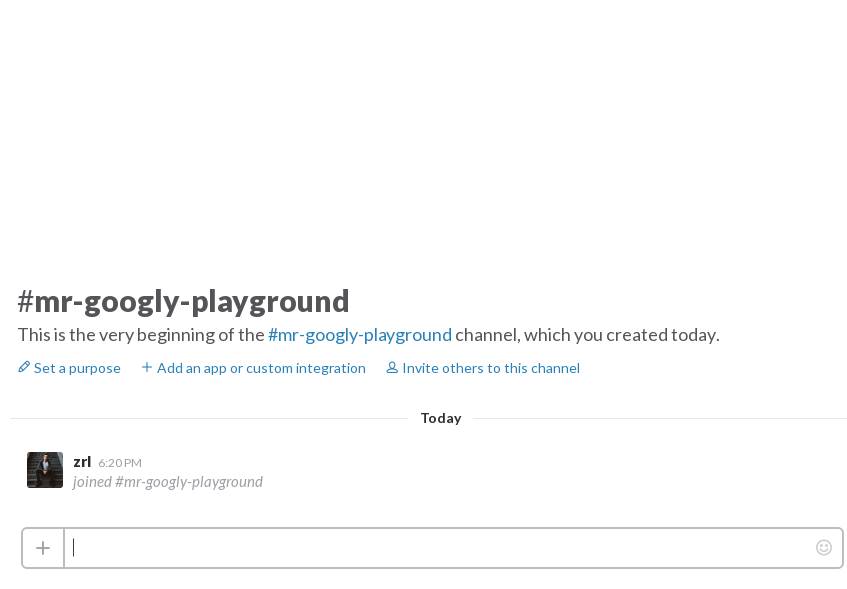
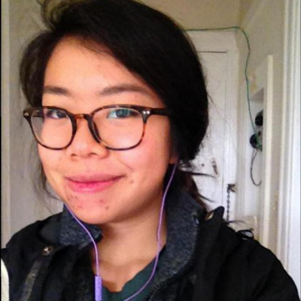
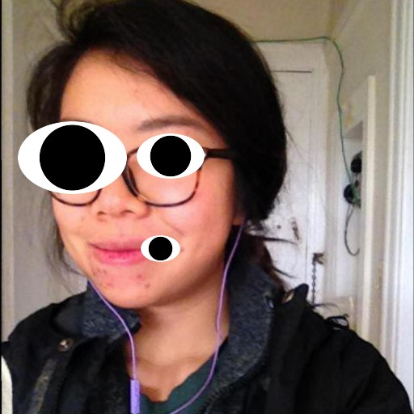
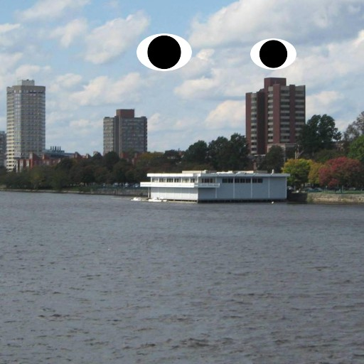
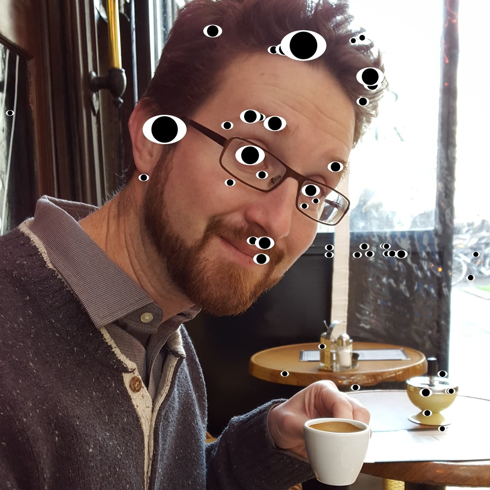

# Meet Mr. Googly

Mr. Googly is a friendly Slack bot that _loves_ googly eyes (maybe a little too
much).

_Built during Hack Night: Stupid Edition._



## Examples

| Before                                                | Mr. Googly                                           |
| ----------------------------------------------------- | ---------------------------------------------------- |
|  |  |
|   |   |
|     |     |

## Give Him a Whirl

Mr. Googly uses
[Docker Compose](https://www.docker.com/products/docker-compose). As long as you
have Docker Compose set up, you should be good to go.

Create a file called `.env` with an entry for Mr. Googly's Slack API token.

```
SLACK_API_TOKEN=REPLACE
```

Then launch the application using Docker Compose. This may take a while on first
run because Docker Compose will need to build Mr. Googly's image, which includes
compiling OpenCV.

    $ docker-compose up

And you should be set! Mr. Googly should be online.

## License

Mr. Googly is licensed under the MIT license. See [`LICENSE`](LICENSE) for the
full text.
